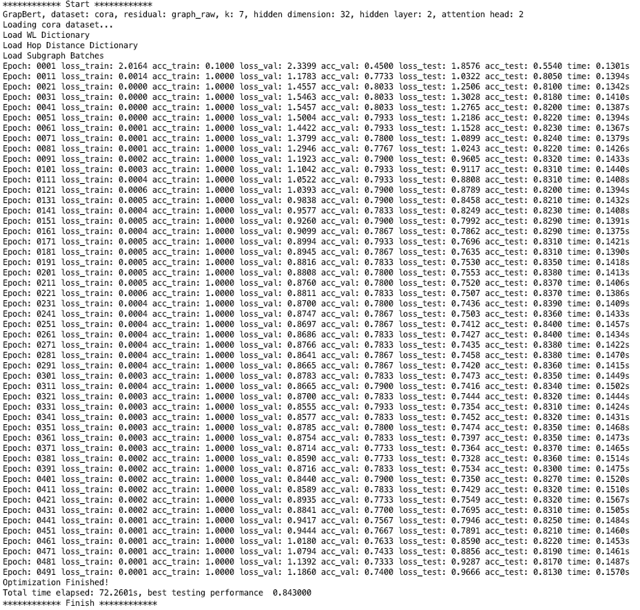

# Graph-Bert

## Graph-Bert: Only Attention is Needed for Learning Graph Representations 

At our group homepage, we have a copy of our latest paper released: http://www.ifmlab.org/files/paper/graph_bert.pdf

The paper at arXiv is available at https://arxiv.org/abs/2001.05140

### Graph-Bert Paper List

A list of the latest research papers on graph-bert can be found via the following link<br>
Page URL: https://github.com/jwzhanggy/graph_bert_work

### Two other papers are helpful for readers to follow the ideas in this paper and the code

(1) SEGEN: Sample-Ensemble Genetic Evolutional Network Model https://arxiv.org/abs/1803.08631

(2) GResNet: Graph Residual Network for Reviving Deep GNNs from Suspended Animation https://arxiv.org/abs/1909.05729

### References

```
@article{zhang2020graph,
  title={Graph-Bert: Only Attention is Needed for Learning Graph Representations},
  author={Zhang, Jiawei and Zhang, Haopeng and Xia, Congying and Sun, Li},
  journal={arXiv preprint arXiv:2001.05140},
  year={2020}
}
```

************************************************************************************************

## How to run the code?

### To run a script, you can just use command line: python3 script_name.py

After downloading the code, you can run
```
python3 script_3_fine_tuning.py
```
directly for node classification. It seems the random seed cannot control the randomness in parameter initialization in transformer, we suggest to run the code multiple times to get good scores.

### What are the scripts used for?

(1) The Graph-Bert model takes (a) node WL code, (b) intimacy based subgraph batch, (c) node hop distance as the prior inputs. These can be computed with the script_1_preprocess.py.

(2) Pre-training of Graph-Bert based on node attribute reconstruction and graph structure recovery is provided by script_2_pre_train.py.

(3) Please check the script_3_fine_tuning.py as the entry point to run the model on node classification and graph clustering. 

(4) script_4_evaluation_plots.py is used for plots drawing and results evaluation purposes.

### How to turn on/off the blocks?

You can change the "if 0" to "if 1" to turn on a script block, and the reverse to turn off a script block.

### Several toolkits may be needed to run the code
(1) pytorch (https://anaconda.org/pytorch/pytorch)
(2) sklearn (https://anaconda.org/anaconda/scikit-learn) 
(3) transformers (https://anaconda.org/conda-forge/transformers) 
(4) networkx (https://anaconda.org/anaconda/networkx) 


************************************************************************************************

## Organization of the code?

A simpler template of the code is also available at http://www.ifmlab.org/files/template/IFM_Lab_Program_Template_Python3.zip

### The whole program is divided into five main parts:

(1) data.py (for data loading and basic data organization operators, defines abstract method load() )

(2) method.py (for complex operations on the data, defines abstract method run() )

(3) result.py (for saving/loading results from files, defines abstract method load() and save() )

(4) evaluate.py (for result evaluation, defines abstract method evaluate() )

(5) setting.py (for experiment settings, defines abstract method load_run_save_evaluate() )

The base class of these five parts are defined in ./code/base_class/, they are all abstract class defining the templates and architecture of the code.

The inherited class are provided in ./code, which inherit from the base classes, implement the abstract methonds.

## Detailed information on funtional classes?

### a. data

(1) DatasetLoader.py (for dataset loading)


### b. method

#### b-1 pre-computing methods

(1) MethodWLNodeColoring.py (for WL code computing)

(2) MethodGraphBatching.py (for subgraph batching)

(3) MethodHopDistance.py (for hop distance computing)

#### b-2 graph-bert basics

(1) MethodBertComp.py (for graph-bert basic components)

(2) MethodGraphBert.py (the graph bert model)

#### b-3 graph-bert applications

(1) MethodGraphBertNodeClassification.py 

(2) MethodGraphBertGraphClustering.py

(3) MethodGraphBertNodeConstruct.py

(4) MethodGraphBertGraphRecovery.py


### c. result

(1) ResultSaving.py (for saving results to file)


### d. evaluate

(1) EvaluateAcc.py (accuracy metric)

(2) EvaluateClustering.py (a bunch of clustering metrics)


### e. setting

(1) Settings.py (defines the interactions and data exchange among the above classes)

************************************************************************************************

## Learning results of Graph-Bert with graph-raw residual on Cora.




************************************************************************************************

## Learning results of Graph-Bert with raw residual on Cora.


************************************************************************************************
