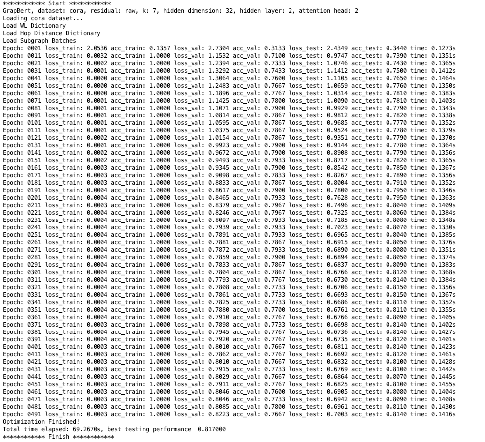

# Graph-Bert
Source code of "Graph-Bert: Only Attention is Needed for Learning Graph Representations". 

The paper is available at https://arxiv.org/abs/2001.05140

Please check the script.py as the entry point. We suggest to run the code with Pycharm. 

Several toolkits may be needed to run the code
(1) pytorch (https://anaconda.org/pytorch/pytorch)
(2) sklearn (https://anaconda.org/anaconda/scikit-learn) 
(3) transformers (https://anaconda.org/conda-forge/transformers) 
(4) networkx (https://anaconda.org/anaconda/networkx) 

************************************************************************************************

Learning results of Graph-Bert with graph-raw residual on Cora dataset.

************************************************************************************************

Learning results of Graph-Bert with raw residual on Cora dataset.

************************************************************************************************
